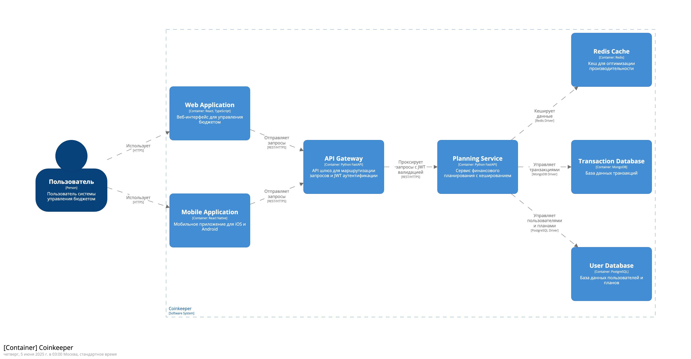

## Лабараторная работа №1
|              **Студент** | **Группа**   | **Вариант** |
|--------------------------|--------------|-------------|
| Гудынин Данила Денисович | М8О-109СВ-24 | 6           |

Целью работы является получение навыка в описании архитектуры в стиле Architecture As A Code и
проектировании системы «сверху вниз».

Необходимо создать описание архитектуры системы в формате Structurizr DSL:
1. Изучите текст задания.
2. Определите перечень ролей пользователей и перечень внешних систем.
3. Создайте описание softwareSystem и диаграмму systemContext
4. Продумайте основные задачи пользователей и как они могут быть реализованы
5. Сформируйте перечень container отвечающих за обработку событий, связанных с объектами
предметной области, определенной в задании (Клиентский сервис, Сервис управления
доставкой, Сервис регистрации платежей …)
1. Определите взаимодействие между контейнерами (создание пользователя, создание заказа на
доставку …)
1. Опишите модель container в Structurizr DSL и создайте диаграмму Container.
2. Определите технологии и проставьте их на контейнерах и связях
3. Создайте одну диаграмму dynamic для архитектурно значимого варианта использования
(отправка сообщения между пользователями, покупка товара в магазине ….)

Результат должен быть оформлен в виде следующих файлов, размещенных в вашем github:
- readme.md с текстом задания
- workspace.dsl с моделью и view

Полезный пример проекта в Structurizr DSL:
https://github.com/DVDemon/architecture_python/tree/main/01_structurizr
Справка по языку: https://docs.structurizr.com/dsl/language

## Вариант 12
Бюджетирование 
https://about.coinkeeper.me/

Приложение должно содержать следующие данные:
- планируемый доход
- планируемый расход
- пользователь

## Диаграммы

### Контекстная диаграмма (System Context)

### Диаграмма контейнеров (Container)

### Диаграмма создания бюджетного плана (Dynamic View - CreateBudgetPlan)

### Диаграмма добавления транзакции (Dynamic View - AddTransaction)

### Диаграмма просмотра аналитики (Dynamic View - ViewAnalytics)
